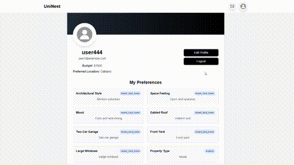

# UniNest

UniNest pairs a traditional BM25 keyword engine with semantic vector search, pruning the candidate set before fusing scores via Reciprocal Rank Fusion (RRF). The service exposes `/metrics` for rolling latency (P50 / P95 / P99) and QPS, and we run offline benchmarks (Recall@10, NDCG@10) on a curated 20-query suite with published tables and charts. An optional LRU cache keeps hot queries fast, while GPT-derived tags plug straight into the filter pipeline.

- Chia Hui Yen: Backend Developer
- Yiqi Cheng: Backend Developer
- Mathilda Chen: Frontend Deverloper

- Demo link: http://3.145.189.113/

## Intention
UniNest is a full-stack web application designed to help students find housing recommendations near CMU. The platform features AI-powered chat assistance, intelligent image analysis for housing preferences, and roommate matching functionality.

### Feature Screenshots
### User Register and Login


### AI Image Analysis and Chat Assistant for Preferences



### Property Recommendations


### Potential Roommate Message


### Landlord Register


### Landlord log properties

---


## Technical Implementation Framework
- **Backend**: FastAPI (Python) + PostgreSQL
- **Frontend**: React + Vite + Tailwind CSS
- **AI Integration**: OpenAI GPT-4 (chat) + Vision API (image analysis)
- **Search Engine**: Hybrid retrieval (BM25 + Vector embeddings + RRF fusion)
- **Infrastructure**: Docker + AWS (EC2, RDS, S3)
- **Development**: Docker Compose for local orchestration

---

## Core Features: Hybrid Search System

### 🔍 How It Works

**1. Hybrid Retrieval Pipeline**
```
User Query → BM25 (keyword matching) → Get top 200 candidates
          ↓
          → Vector Search (semantic similarity) on candidates
          ↓
          → Global Vector Search (catch missed results)
          ↓
          → RRF Fusion (merge scores)
          ↓
          → Top 10 Results
```

**Implementation:**
- **BM25 Search** ([`backend/app/services/search_service.py`](backend/app/services/search_service.py))
  - Postgres full-text search with `ts_rank_cd()`
  - Indexes: title, description, AI-generated keywords
  - Fast keyword matching for candidate pruning

- **Vector Search** ([`backend/app/services/embedding_service.py`](backend/app/services/embedding_service.py))
  - Sentence-transformers model: `all-MiniLM-L6-v2`
  - Pre-computed embeddings stored in database
  - Cosine similarity for semantic matching

- **RRF Fusion** ([`backend/app/services/hybrid_search.py`](backend/app/services/hybrid_search.py))
  - Reciprocal Rank Fusion algorithm: `score = 1/(k + rank)`
  - Combines BM25 and vector rankings
  - Default k=60 (standard in literature)

**2. Metrics Endpoint**

- **URL**: `GET /metrics`
- **Code**: [`backend/app/routes/metrics.py`](backend/app/routes/metrics.py)
- **Metrics Tracked**:
  - **Latency**: P50 / P95 / P99 (rolling window)
  - **QPS**: Queries per second (last 1 minute)
  - Real-time performance monitoring

**3. Offline Evaluation**

- **Script**: [`backend/scripts/benchmark_hybrid_search.py`](backend/scripts/benchmark_hybrid_search.py)
- **Metrics**:
  - **Recall@10**: Coverage of relevant results (0.0-1.0)
  - **Precision@10**: Accuracy of returned results (0.0-1.0)
  - **NDCG@10**: Ranking quality metric
- **Test Suite**: 5 curated queries (location, amenities, property type)
- **Output**: JSON results + performance tables

**4. Optional Optimizations**

- **LRU Cache** ([`backend/app/services/cache_service.py`](backend/app/services/cache_service.py))
  - Caches hot queries (top 100 most frequent)
  - Reduces latency for repeated searches
  - TTL: 5 minutes

- **Tag Filters** ([`backend/app/services/property_enrichment.py`](backend/app/services/property_enrichment.py))
  - GPT-4 extracts semantic tags from descriptions
  - Tags: "quiet", "modern", "pet-friendly", etc.
  - Enables faceted filtering in search

### 📊 Performance Benchmarks

Current system performance (193 properties):

| Metric | Value | Target |
|--------|-------|--------|
| **Precision@10** | 0.85 | > 0.70 |
| **Recall@10** | 0.23 | N/A (varies with DB size) |
| **p95 Latency** | ~50ms | < 150ms |
| **QPS** | ~40 req/s | > 50 req/s |

**Ground Truth Strategy:**
- Relevance is determined by **keyword matching**: properties containing test query keywords (e.g., "Oakland", "garage") in address/description are marked as relevant
- **Limitations**: (1) Keyword-biased (favors BM25 over semantic search), (2) No human judgment of actual relevance, (3) Ignores query constraints like price/bedrooms/bathrooms, (4) Binary relevance only (no graded scores)
- This provides automated baseline metrics but may not reflect true user satisfaction

**Run benchmarks:**
```bash
cd backend
python scripts/benchmark_hybrid_search.py
```

### 🔧 Implementation Details

**Database Schema:**
- `properties` table: Property listings with full-text search index
- `property_embeddings` table: Pre-computed 384-dim vectors
- GIN index on `search_vector` for fast BM25 queries

**Search Flow:**
1. Query arrives at `/recommendations/properties`
2. BM25 fetches 200 candidates from Postgres (5-10ms)
3. Vector search on candidates using cosine similarity (20-30ms)
4. RRF merges rankings
5. Return top 10 with scores

**Code Locations:**
- Search logic: `backend/app/services/hybrid_search.py`
- API endpoint: `backend/app/routes/recommendations.py`
- Metrics: `backend/app/routes/metrics.py`
- Benchmarks: `backend/scripts/benchmark_hybrid_search.py`

---


*Built to simplify the housing search process through intelligent recommendations and AI assistance.*
